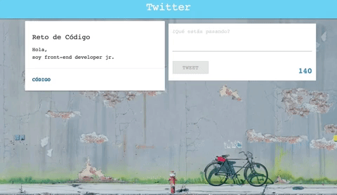

# Twitter

* **Unidad:** _Maquetado web con HTML & CSS_

***

El reto consiste en replicar la página de  _Twitter_.

## Objetivo

Hacer uso de DOM y CSS, para replicar el siguiente resultado a lograr:

## Resultados

* Cumple con los requisitos del resultado a lograr, además se añadio mejores estilos a la página, logrando una mejor visualización.

* Se añadio la función `hora: 

* El resultado fue el siguiente [sitio original](https://jessica2011.github.io/twitter/)

 
